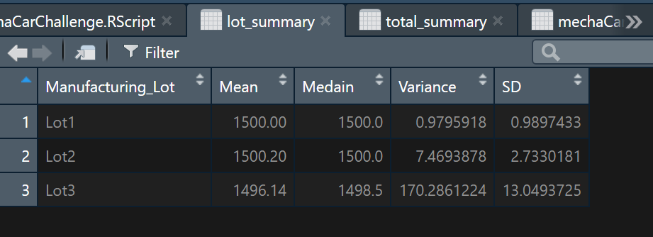

# MechaCar_Statistical_Analysis

## Linear Regression to Predict MPG

  - Which variables/coefficients provided a non-random amount of variance to the mpg values in the dataset?
    
     Vehicle weight, spoiler angle, and AWD all provided non-random amounts of variance.

  - Is the slope of the linear model considered to be zero? Why or why not?

      The slope is no zero due to the coeffeicients that were less than the significance level, which were vehicle length and ground clearance.

  - Does this linear model predict mpg of MechaCar prototypes effectively? Why or why not?

      Due to the null hypothesis being rejected and the linear slope not being zero, this modle could be used to predict mpg of MechaCar prototypes.
    
## Summary Statistics on Suspension Coils

  - The design specifications for the MechaCar suspension coils dictate that the variance of the suspension coils must not exceed 100 pounds per square inch. Does the current manufacturing data meet this design specification for all manufacturing lots in total and each lot individually? Why or why not?

    The manufacturing data meets the design specification of the variance of the coils not exceeding 100 pounds per square inch in the totals of all lots combined, witha variance of approximatly 62, as depicted directly below.

   As for meeting the design specifications when analyzing specific lots, one of the lots exceeds 100 pounds per square inch.  As depicted below, lot 3 is way over the design specification, when looking at the variance column.
    
   
   
   
## T-Tests on Suspension Coils

  
   
   

    
