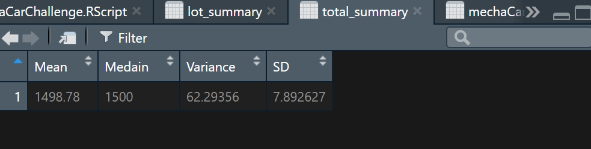

# MechaCar_Statistical_Analysis

## Linear Regression to Predict MPG

  - Which variables/coefficients provided a non-random amount of variance to the mpg values in the dataset?
    
     Vehicle weight, spoiler angle, and AWD all provided non-random amounts of variance.

  - Is the slope of the linear model considered to be zero? Why or why not?

      The slope is no zero due to the coeffeicients that were less than the significance level, which were vehicle length and ground clearance.

  - Does this linear model predict mpg of MechaCar prototypes effectively? Why or why not?

      Due to the null hypothesis being rejected and the linear slope not being zero, this modle could be used to predict mpg of MechaCar prototypes.
    
## Summary Statistics on Suspension Coils

  - The design specifications for the MechaCar suspension coils dictate that the variance of the suspension coils must not exceed 100 pounds per square inch. Does the current manufacturing data meet this design specification for all manufacturing lots in total and each lot individually? Why or why not?

    The manufacturing data meets the design specification of the variance of the coils not exceeding 100 pounds per square inch in the totals of all lots combined, witha variance of approximatly 62, as depicted directly below.

   As for meeting the design specifications when analyzing specific lots, one of the lots exceeds 100 pounds per square inch.  As depicted below, lot 3 is way over the design specification, when looking at the variance column.
    
   
   
   
## T-Tests on Suspension Coils

  Analysis shows that testing is nearly 100% consistent across all lots when analyzed together, witha p-value of .97 and 100% consistent when numbers were analyzed for lot 1 specifically.  Lot 1 holds a p-value of 1.  However, lots 2 and 3 are not consistent.  As depicted below, lot 2 holds a p-value of .61 and lot 3 is .04.
  
  
  
  
  
  
 ## Study Design: MechaCar vs Competition
 
  - What metric or metrics are you going to test?
  
    Some metrics to test would be miles per gallon (both city and highway), maintenance costs, and overall cost of the vehicle.
    
  - What is the null hypothesis or alternative hypothesis?

    While comparing the metrics between out vehicles and competitors vehicles, the null hypothesis would have a conculsion of no significant differences between our vehicles and theirs.  Ideally, the alternative hypothesis would show that our vehicle outperforms the competition.
    
  - What statistical test would you use to test the hypothesis? And why?

    Multiple linear regression tests could be run the test this hypothesis.  This test would give us different facets of information when comparing our vehicles to others.
    
  - What data is needed to run the statistical test?

    Data needed to run these tests would be sets of information of comeptitions' vehicles (MPG, maitenance costs, overall costs) as well as information on our vehicles in the same categories. 

  
   
   

    
